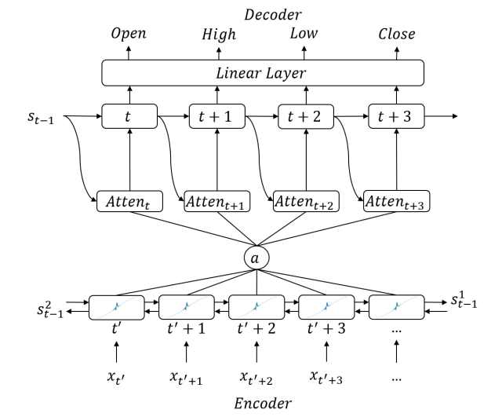
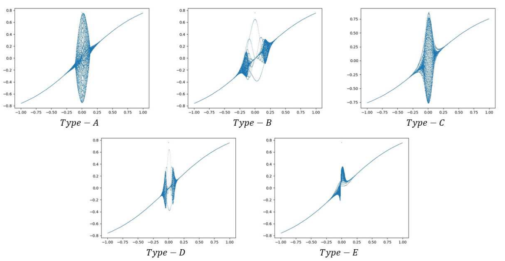
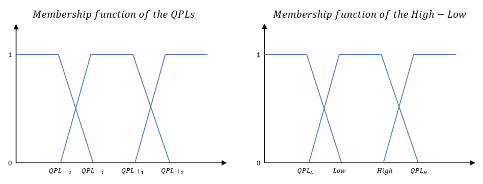
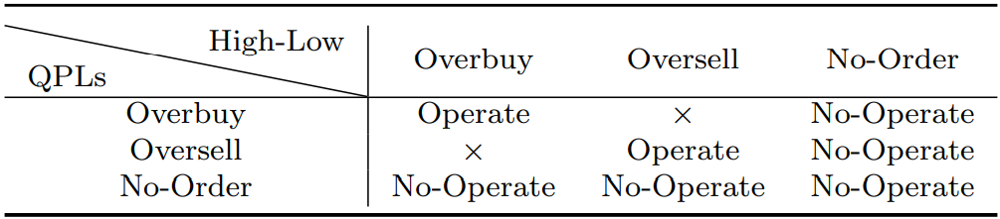
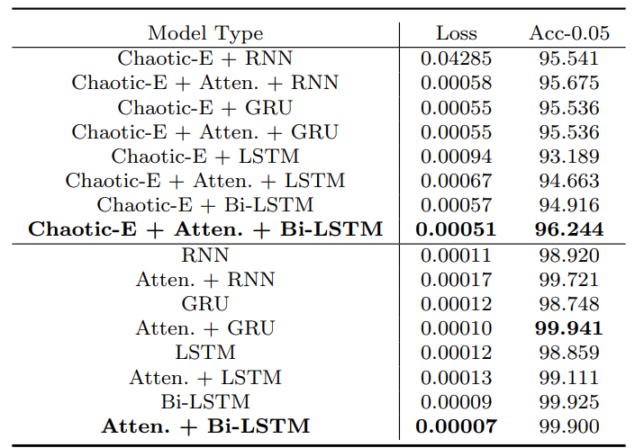
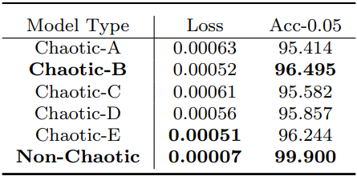
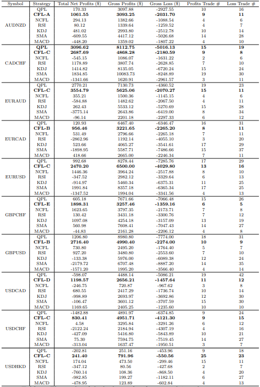

# :balance_scale: Chaotic Quantum Finance Trading System (Soft Computing 2023) :balance_scale:
This repository contains the source code for our paper.

**Chaotic Bi-LSTM and Attention HLCO Predictor Based Quantum Price Level Fuzzy Logic Trading System**
<a href="https://www.researchsquare.com/article/rs-1819548/latest.pdf">
    
</a>

Jiahao LI, Zihao Huang, Lirong Lin, Yuchen Guo, Raymond Lee

## :bulb: Abstract
There are various indicators i.e. Relative Strength Index (RSI), Moving Average Convergence Divergence (MACD), Stochastic Oscillator which have advantages in applications to determine not only market movements with buying and selling decisions in Computational Finance, but have significant drawbacks that discrepancies are easy to match against the best trading times due to fixed order-triggering boundaries and delay problems. For example, RSI’s 70 and 30 overbuy and oversell are fixed boundaries. Orders can only be triggered when RSI’s value exceeds one of the boundaries. Its computation only considers past market situation prompting indicators like RSI to trigger orders with delay. In this paper, we proposed a method to reduce these problems with advanced AI technologies to generate indicators’ buy and sell signals executed in the best trading time. Recurrent Neural Network (RNN) has outstanding performance to learn time-series data automatic with long-time sequences but ordinary RNN units such as Long-Short-Term-Memory(LSTM) are unable to decipher the relationships between time units, so-called context. Hence, researchers have proposed an algorithm based on RNNs’ Attention Mechanism allowing RNNs to learn information such as chaotic attributes and Quantum properties contained in time sequences. Chaos Theory and Quantum Finance Theory (QFT) are also proposed to simulate these two features. One of the well-performed QFT models is Quantum Price Level (QPL) to simulate all possible vibration levels to locate price. The system used in this paper consists of two components - **neural network** and **fuzzy logic**. Neural networks are used to predict future data and to solve indicators lagging problem whereas fuzzy logic is used to solve fixed order-triggering boundaries problem. By combining these two core components, our model has obtained remarkable results in backtesting previous data. We believe that it is possible for these methods to make better investment decisions when the market changes constantly.

**Our main contributions are:**
- We propose a novel neural network guided price predictor with Attention Mechanism, Bidirectional LSTM, Chaotic Neuro-Oscillator, and Quantum Price Level to predict future High, Low, Close and Open (HLCO) prices.
- We introduce a novel fuzzy logic-based trading strategy combine with the above price predictor to remedy fixed order-triggering boundaries and the dilemma of traditional finance indicators. 
- Our method obtained remarkable results in backtesting previous data.

## :brain: Core Technique
<p align="center"></p>
<div align="center">
  </img>
</div>
<p></p>

The architecture of Chaotic HLCO Predictor, which employs the Bi-LSTM to extract time-series feature from the previous price data and replaces the activation function with Chaotic Neuro-Oscillators to simulate the high randomness in the market fluctuations.

<p align="center"></p>
<div align="center">
  </img>
</div>
<p></p>

The visualization of different types of Tanh-based Chaotic Neuro-Oscillators. All the Chaotic Neuro-Oscillators originate from Lee-Oscillators invented by [Prof. Raymond Lee](https://fst.uic.edu.cn/cst_en/faculty/faculty.htm#/raymondshtlee/en), which can assign the property of high randomness to any functions (The middle region in the visualization).

<p align="center"></p>
<div align="center">
  </img>
</div>
<div align="center">
  </img>
</div>
<p></p>

The visualization of membership function (**Row 1**) and the designed fuzzy rule (**Row 2**) in our fuzzy logic trading strategy (`X` is the meaningless rule).

## :clapper: Results
<p align="center"></p>
<div align="center">
  </img>
</div>
<p></p>

The accuracy of the Chaotic HLCO Predictor. Even with the high randomness of the Chaotic Neuro-Oscillator, the accuracy will not drop a lot.

<p align="center"></p>
<div align="center">
  </img>
</div>
<p></p>

The ablation study of the different types of the Chaotic Neuro-Oscillator in the accuracy of the price prediction.

<p align="center"></p>
<div align="center">
  </img>
</div>
<p></p>

The backtest trading results of 10 Futures (CFL-X is our Chaotic Fuzzy Logic Trading Stategy with type-x Chaotic Neuro-Oscillator in the HLCO Price Predictor).

## :gear: Environment Settings
```Shell
pip install -r requirements.txt
```

## :floppy_disk: Data Preparation
**Step 1**: Copy the FXTrainData.mq4 into the MetaTrader4 software.

**Step 2**: Run the codes to get the training data.

**Step 3**: Copy and paste the generated data into the directory you set in the Params.txt file.

**Hint**: For prediction, you can generate the data by yourself, and put it in your own directory.

## :wrench: Parameter Settings

**Hint**: All the hyper-parameters' configurations are placed in the Params.txt file.

**Hint**: For more details of the Lee-Oscillator, please go through this link: https://www.researchgate.net/figure/Different-Parameter-Settings-used-in-LEE-Oscillator-RS-Model_tbl1_237242811 and download the paper of the [Prof. Raymond Lee](https://fst.uic.edu.cn/cst_en/faculty/faculty.htm#/raymondshtlee/en).

- `LeeTanhType` is the type of the Lee-Oscillator based tanh activation function.
- `LeeSigType` is the type of the Lee-Oscillator based sigmoid activate function.
- `K` is the hyper-parameter in the Lee-Oscillator.
- `N` is the hyper-parameter in the Lee-Oscillator.
- `Chaotic` is the controller of whether use the Lee-Oscillator to form the chaotic activation function.
- `inputSize` is the input size for the LSTM unit.
- `hiddenSize` is the hidden size for the LSTM unit.
- `outputSize` is the output size for the LSTM unit.

**Warning**: Please do not change the value of the inputSize and outputSize.

- `learningRate` is the lr for gradient descent.
- `momentum` is the momentum for gradient descent.
- `weightDecay` is the weight decay for the gradient descent.
- `AccBound` is the accuracy precision.
- `trainPercent` is the split standard of the total data.
- `batchSize` is the size of each batch.
- `epoches` is the number of the training epoches.
- `seed` is the random seed.
- `GPUID` is the ID of the gpu.
- `modelDir` is the directory to store all the models.
- `logDir` is the directory to store all the training information.
- `dataDir` is the directory to get the training data.
- `prededDir` is the directory to store the predicted data.
- `predDataDir` is the directory to get the predicting data.

## :test_tube: Evaluation
1. `Prediction`
    ```Shell
    python Predictor.py
    ```
    **Hint**: Pay attention to the directories you configured in the Params.txt. All the csv file should be put correctly.

2. `Trading Strategy`

    The trading strategy is based on Fuzzy Logic.

    We designed a Fuzzy Logic with the predicted High and Low values and Quantum Price Levels.

    More details please check the sub-routines in the FLStrategy.mq4 file.

# :books: Training
**Warning**: Before you train the model please ensure that you open the visdom server by following the code `python -m visdom.server`.

```Shell
python Trainer.py
```

# :open_book: Citation
If you find our works useful in your research, please consider citing our paper.
```bibtex
@article{lee2023chaotic,
  title={Chaotic Bi-LSTM and attention HLCO predictor-based quantum price level fuzzy logic trading system},
  author={Lee, Jiahao and Huang, Zihao and Lin, Lirong and Guo, Yuchen and Lee, Raymond},
  journal={Soft Computing},
  volume={27},
  number={18},
  pages={13405--13419},
  year={2023},
  publisher={Springer}
}
```

**Hint**: We also implement a Transformer version of the Chaotic HLCO Predictor in [https://github.com/JarvisLee0423/Chaotic-Quantum-Finance-Trading-System-with-Transformer](https://github.com/JarvisLee0423/Chaotic-Quantum-Finance-Trading-System-with-Transformer). Please feel free to check the code. `However, this code is not well-verified by us yet`.

## Acknowledgements
This paper was supported by Research Grant R202008 of Beijing Normal University-Hong Kong Baptist University United International College (UIC) and Key Laboratory for Artificial Intelligence and Multi-Model Data Processing of Department of Education of Guangdong Province.
